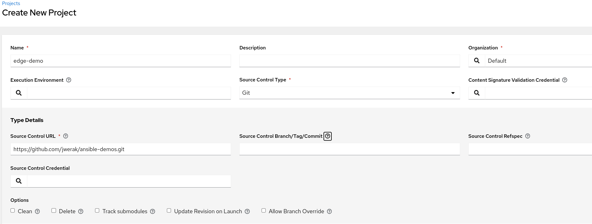
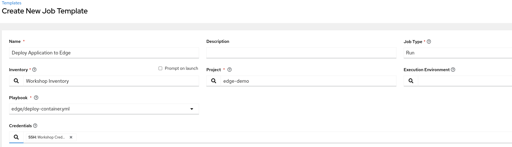
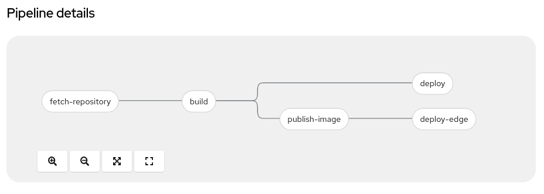
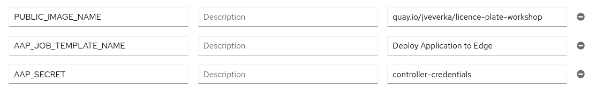
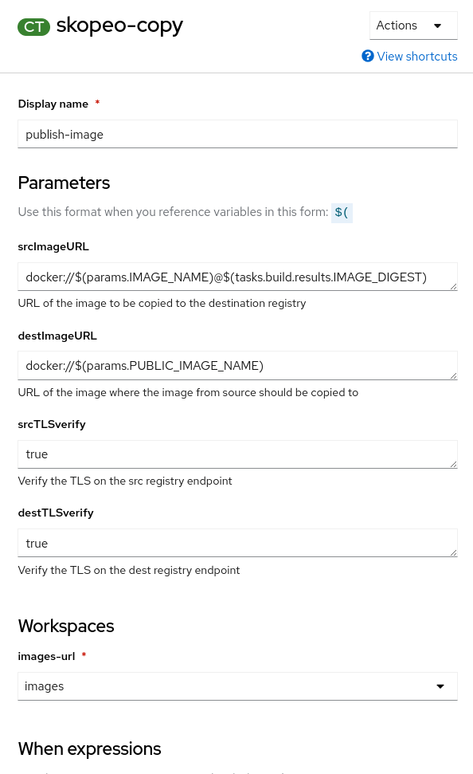
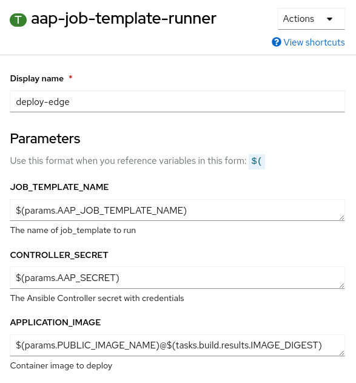

# Red Hat OpenShift Data Science - Licence plate recognition workshop

https://redhat-scholars.github.io/rhods-lp-workshop/rhods-lp-workshop/index.html

## Extend Pipeline to deploy model to Edge Servers using AAP

This extension edit pipeline to:
- Push image to external registry
- Run Ansible Automation via Ansible Controller API.

### Prerequisites

- OpenShift with this application deployed, including pipeline
- Write access to Container registry
- Ansible Automation Controller with Job Template to be used
  - Create Ansible Controller Project, e.g from [this git repo](https://github.com/jwerak/ansible-demos.git)
    - 
  - Create Job Template in Ansible Controller
    - 

### Setup

- Download Credentials to Container registry and assign it to the pipeline service account
  - e.g. create robot account for quay.io repository
  - `oc apply -f secret.yml`
  - `oc secrets link pipeline secret-name --for=pull,mount`
- Create Secret with credentials to Ansible Controller
  - `oc create secret generic controller-credentials --from-literal=CONTROLLER_HOST=https://student1.sr8vq.example.opentlc.com --from-literal=CONTROLLER_OAUTH_TOKEN=secret-token`
- Create a tekton task to call Ansible Controller API
  - `oc apply -f ./tekton/task-awx-cli.yaml`

### Update pipeline

The updated pipeline structure:

Add parameters to pipeline:
- PUBLIC_IMAGE_NAME
- AAP_JOB_TEMPLATE_NAME
- AAP_SECRET

Add *skopeo-copy* task to copy image to remote repository

Add *aap-job-template-runner* task

